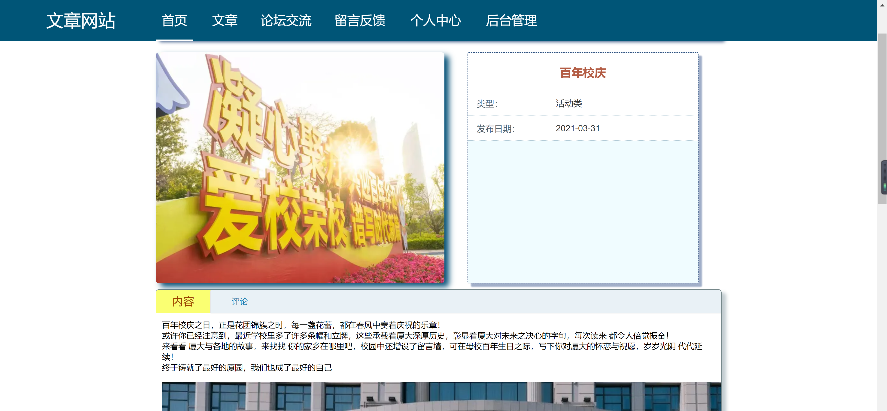
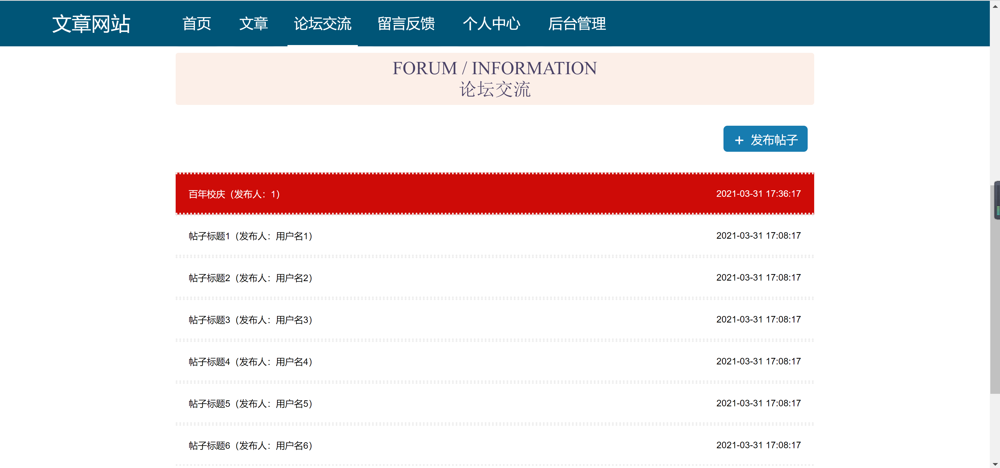
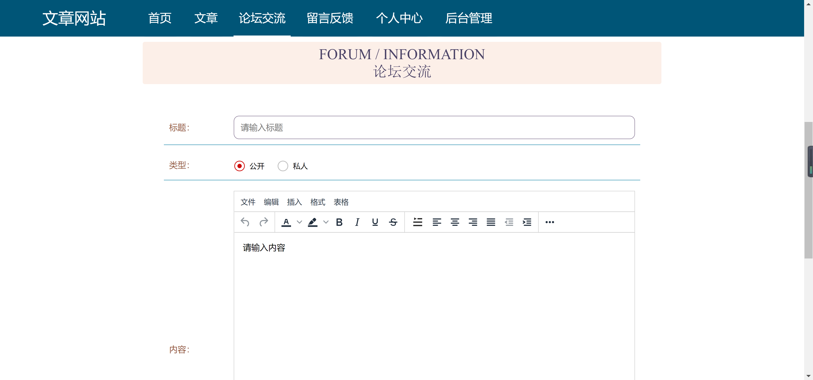
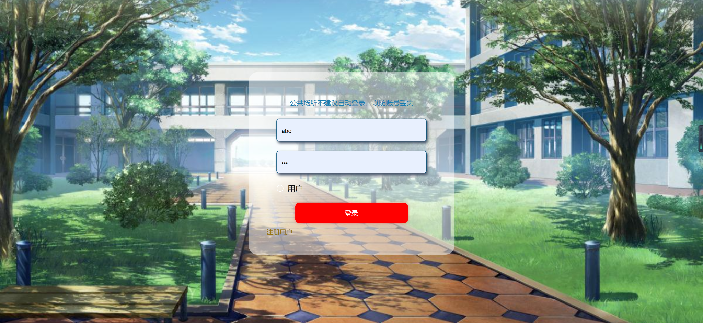
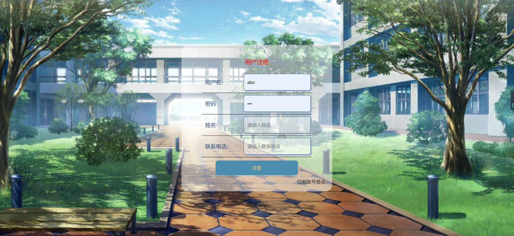
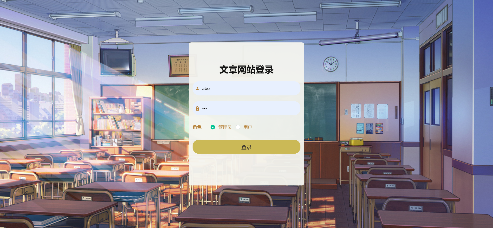
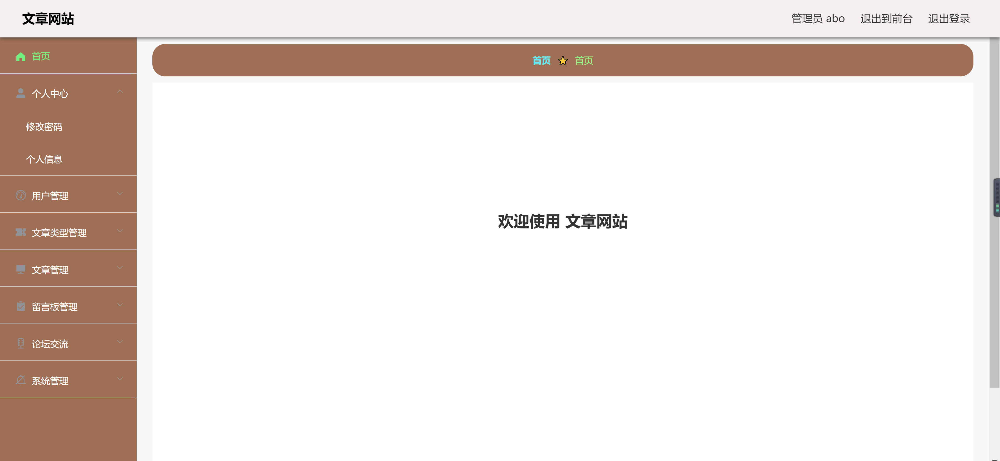
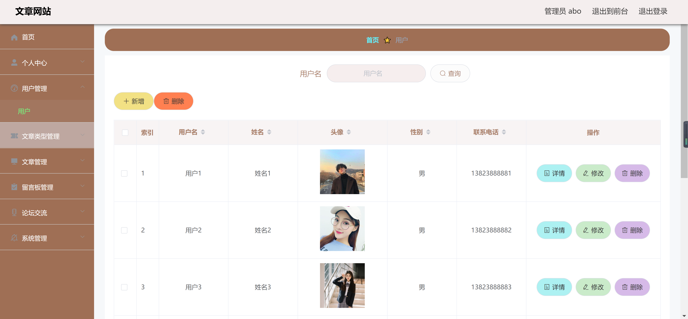
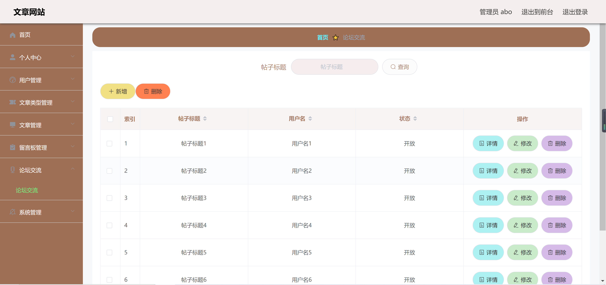

# 144.ArticleForumManagementSystem

<h2>前端：Vue，后端：SpringBoot</h2>

<h1 align="center">A01.文章论坛管理系统</h1>

	
    
    
    

## 简介
> 本代码仅供学习参考使用,请加QQ(1120041844)获取完整项目!
> 
>访问路径
>
> http://localhost:8080/springbootr1tjf/front/index.html
>
> http://localhost:8080/springbootr1tjf/admin/dist/index.html#/index
>
> 密码 : abo abo

## 环境

- <b>IntelliJ IDEA 2009.3</b>

- <b>Mysql 5.7.26</b>

- <b>Tomcat 7.0.73</b>

- <b>JDK 1.8</b>

## 缩略图

## License

# [更多论文: 全目录查看](https://gitee.com/jiananxu/projects)

